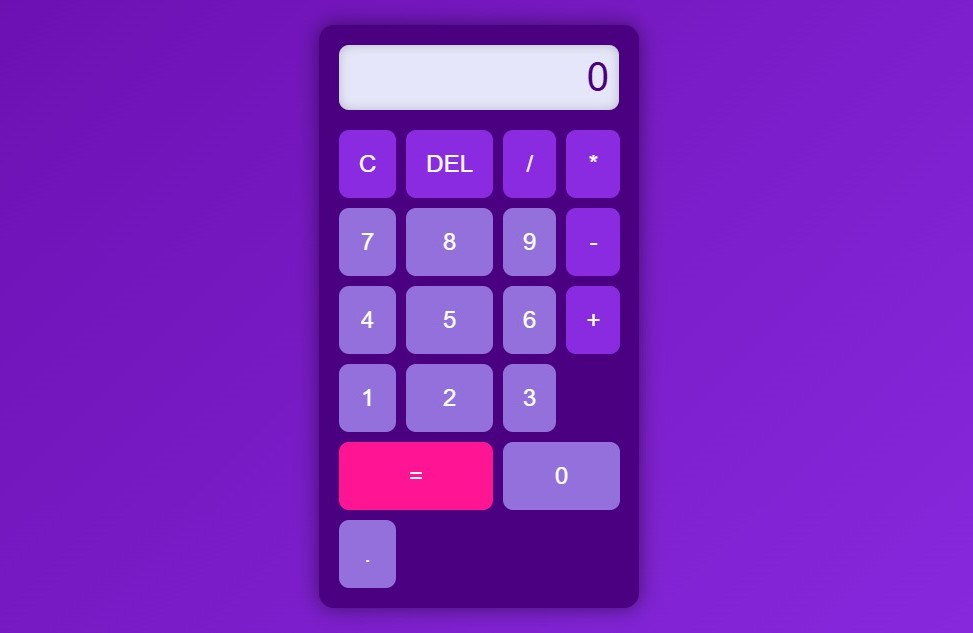

# Purple Calculator 🧮

A simple and modern calculator with a purple-themed design, built using **HTML**, **CSS**, and **JavaScript**.

  
*Screenshot of the calculator in action.*

---

## Features ✨
- **Basic Operations**: Addition, subtraction, multiplication, and division.
- **Reset Button**: Clear all inputs with the `C` button.
- **Delete Button**: Remove the last character with the `DEL` button.
- **Responsive Design**: Works well on both desktop and mobile devices.

---

## How to Use 🚀
1. Clone this repository:
   ```bash
   git clone https://github.com/username/aplikasi-kalkulator.git

   
## Demo 🎥
Check out the live demo 
 ```bash
https://anismarsela32.github.io/aplikasi-kalkulator/

   
